# 電力データ分析基盤（Energy Data Platform）

Google Cloud Platformを活用したデータ分析基盤です。
東京電力エリアの電力使用量を予測するため、東京電力API・気象APIからデータを自動収集し、
ETL処理、XGBoostによる14日間の電力使用量予測、Looker Studioによる可視化・監視までを統合した自動化パイプラインを実装しています。
データ収集～基盤設計・構築～データマート作成・BIダッシュボード構築まで一気通貫で実装し、
さらに機械学習による予測まで対応できるスキル実証を目的とし個人開発にて構築しています。

## プロジェクト概要

- **目的**: データエンジニアリング × MLエンジニアリングの統合スキル実証
- **アプローチ**: データ収集～基盤設計・構築～データマート作成・BIダッシュボード構築まで一気通貫で実装
- **技術要素**: データ収集（東電API・気象API）→ ETL処理（BigQuery）→ 機械学習（XGBoost）→ BI可視化（Looker Studio）
- **予測機能**: 14日間（336時間）の時系列予測、MAPE 7%程度
- **ダッシュボード**: [Looker Studioで可視化](https://lookerstudio.google.com/s/kf7uvYCkRT4)

## 主要機能

### 1. 自動データ収集パイプライン
- **電力データ**: 東京電力APIから実績データを自動取得
- **気象データ**: Open-Meteo APIから関東全域の気象データを取得
- **データ品質チェック**: 欠損値・異常値の自動検知とログ記録

### 2. 機械学習による予測
- **XGBoostモデル**: 時系列パターンを重視した12特徴量による予測
- **特徴量エンジニアリング**:
  - ラグ特徴量（1日前・7日前・1営業日前）
  - カレンダー特徴量（曜日・祝日・時間帯・循環特徴量）
  - 気象特徴量（気温・湿度・降水量）
- **段階的予測**: 実運用を想定した14日間の段階的予測

### 3. データ基盤（Google Cloud Platform）
- **BigQuery**: データウェアハウス（8テーブル構成）
  - 電力・気象の統合データ
  - 予測結果の履歴管理
  - システム監視ログ
- **Cloud Storage**: 生データの永続化

### 4. 運用監視システム
- **7プロセス監視**: ETLパイプライン全体の実行状況を監視
- **データ品質チェック**: 自動品質検証とアラート
- **予測精度検証**: 14日ごとの精度検証と分析
- **実行ログ管理**:
  - ローカルファイルとBigQueryへの二重記録
  - 処理時間・成功/失敗ステータスの自動記録
  - Looker Studioでの可視化
- **統合ダッシュボード**: [Looker Studioで可視化](https://lookerstudio.google.com/s/kf7uvYCkRT4)

## システムアーキテクチャ

```mermaid
%%{
  init: {
    'theme':'dark',
    'themeVariables': {
      'fontSize':'17px',
      'fontFamily':'Arial',
      'clusterBkg':'#1f2937',
      'clusterBorder':'#0b163a',
      'labelTextColor':'#ffffff'
    }
  }
}%%
graph TB
    subgraph オーケストレーション層
        O1["<b>Apache Airflow</b><br/><i>DAGスケジューリング</i>"]
    end

    subgraph DockerCompose["Docker Compose 実行基盤"]
        subgraph データ収集層
            A1["<b>東京電力API</b>"]
            A2["<b>Open-Meteo API</b>"]
            A1 --> B1["<b>PowerDataDownloader</b>"]
            A2 --> B2["<b>WeatherDownloader</b>"]
        end

        subgraph ETL処理層
            C1["<b>データクレンジング</b>"]
            C2["<b>BigQueryロード</b>"]
            C3["<b>dbt</b><br/><i>データマート作成</i>"]
            C1 --> C2
            C2 --> C3
        end

        B1 --> C1
        B2 --> C1

        subgraph 機械学習層
            E1["<b>XGBoostモデル</b><br/><i>MAPE 7%程度</i>"]
            E2["<b>14日間段階的予測</b><br/><i>336時間予測</i>"]
            E1 --> E2
        end
    end

    O1 -->|Task Trigger| DockerCompose

    subgraph データ基盤層GCP
        D1["<b>BigQuery</b><br/>━━━━━━━━━━━<br/>• power_weather_integrated<br/>• ml_features<br/>• prediction_results<br/>• prediction_accuracy<br/>• system_status<br/>• process_execution_log<br/>• data_quality_checks<br/>• dashboard_data"]
        D2["<b>Cloud Storage</b><br/><i>バックアップ・履歴管理</i>"]
    end

    C2 --> D1
    C2 --> D2
    C3 --> D1
    E2 --> D1
    D1 --> E1

    subgraph 可視化監視層
        F1["<b>Looker Studio</b><br/>━━━━━━━━━━━<br/>• システム監視(7プロセス)<br/>• 予測結果表示<br/>• 予測精度分析<br/>• データ品質チェック結果"]
    end

    D1 --> F1

    classDef defaultStyle fill:#1a223d,stroke:#9fa8da,stroke-width:0.5px,color:#fff,rx:10,ry:10

    class O1,A1,A2,B1,B2,C1,C2,C3,D1,D2,E1,E2,F1 defaultStyle

    style オーケストレーション層 rx:15,ry:15
    style DockerCompose rx:15,ry:15,fill:#2d3748
    style データ収集層 rx:15,ry:15
    style ETL処理層 rx:15,ry:15
    style データ基盤層GCP rx:15,ry:15
    style 機械学習層 rx:15,ry:15
    style 可視化監視層 rx:15,ry:15
```



## 技術スタック

| カテゴリ | 技術 |
|---------|------|
| **言語** | Python 3.12 |
| **機械学習** | XGBoost, scikit-learn |
| **データ処理** | pandas, numpy, dbt |
| **クラウド** | Google Cloud Platform (BigQuery, Cloud Storage) |
| **ワークフロー** | Apache Airflow, Docker Compose |
| **BI/可視化** | Looker Studio |
| **API** | 東京電力API, Open-Meteo API |

## 予測精度と成果

### 予測精度（MAPE: Mean Absolute Percentage Error）

| モデル | MAPE | 説明 |
|--------|------|------|
| **カレンダー特徴量のみ** | 7%程度 | ベースライン（曜日・時間帯・祝日） |
| **全特徴量（1週間予測）** | 2-3%程度 | 実測値ラグを使用した短期予測 |
| **段階的予測（14日間）** | **7%程度** | 予測値ラグを使用した実運用想定 |

### 技術的成果

1. **段階的予測による実運用対応**
   - 短期予測（1週間）: MAPE 2-3%程度
   - 長期予測（14日間）: MAPE 7%程度

2. **完全自動化パイプライン**
   - データ収集からBigQuery投入まで完全自動化
   - Apache Airflow + Docker Composeによる日次自動実行
   - dbtによるデータ変換・データマート作成
   - 失敗時はリトライ処理を実装し、BigQueryログ経由で監視可能
   - システム監視とアラート

   

3. **データ可視化・BI実装**
   - Looker Studioダッシュボードを設計・実装
   - 7プロセス監視、予測結果、精度分析、データ品質を統合
   - BigQueryとの連携による日次自動更新

4. **実運用対応**
   - 土日祝日の欠損値自動処理
   - API制限への対応
   - パーティション設計による大規模データ管理

5. **データ品質管理**
   - 自動品質チェック（欠損値・外れ値検出）
   - 実行ログの完全記録
   - 予測精度の継続的検証

### AI支援による開発プロセス

**Claude Code**:
- 初期コード生成にClaude Codeを活用
- AI出力をそのまま用いるのではなく全コードを精査し、構造設計・リファクタリング・機能追加を開発者が主導し最適化
- ペアプログラミング的な活用により開発効率を向上

## プロジェクト構成

```
energy-prediction-pipeline/
├── dags/
│   └── energy_etl_dag.py          # Airflow DAG定義
├── dbt_energy/
│   ├── models/
│   │   ├── marts/
│   │   │   ├── ml_features.sql    # ML特徴量テーブル
│   │   │   └── dashboard_data.sql # ダッシュボード用テーブル
│   │   └── staging/
│   │       └── sources.yml        # ソーステーブル定義
│   ├── dbt_project.yml            # dbtプロジェクト設定
│   └── profiles.yml               # BigQuery接続設定
├── src/
│   ├── data_processing/           # データ収集・処理
│   │   ├── data_downloader.py     # 東京電力APIからデータ取得
│   │   ├── weather_downloader.py  # 気象データ取得
│   │   ├── weather_bigquery_loader.py # 気象データBigQuery投入
│   │   ├── power_bigquery_loader.py   # 電力データBigQuery投入
│   │   ├── dbt_runner.py          # dbt実行モジュール
│   │   ├── prediction_accuracy_updater.py # 予測精度検証データ更新
│   │   └── system_status_updater.py   # システムステータス更新
│   ├── pipelines/
│   │   └── main_etl.py            # 統合ETLパイプライン
│   ├── prediction/
│   │   └── prediction_iterative_with_export.py # 段階的予測実行
│   ├── monitoring/
│   │   └── data_quality_checker.py # データ品質チェック
│   └── utils/
│       └── logging_config.py       # ログ設定
├── docker-compose.yml              # Airflow環境定義
├── Dockerfile                      # パイプライン用コンテナ
├── sql/                            # BigQueryテーブル定義
├── scripts/                        # 運用スクリプト
├── requirements.txt                # Python依存パッケージ
└── SETUP.md                        # セットアップ手順
```

## セットアップ

### 前提条件

- Docker / Docker Compose
- Google Cloud Platformアカウント
- BigQueryプロジェクト
- GCPサービスアカウントキー

### インストール手順

1. **リポジトリのクローン**
```bash
git clone https://github.com/yourusername/energy-data-platform.git
cd energy-data-platform
```

2. **GCPサービスアカウントキーの配置**
```bash
# keys/ディレクトリにサービスアカウントキーを配置
cp /path/to/service-account-key.json keys/
```

3. **環境変数の設定**
```bash
# .envファイルを作成
cp .env.template .env

# 必要な環境変数を設定
GCP_PROJECT_ID=your-project-id
GOOGLE_APPLICATION_CREDENTIALS=/app/keys/service-account-key.json
```

4. **Dockerイメージのビルドと起動**
```bash
docker compose up -d
```

5. **BigQueryテーブルの作成**
```bash
# sqlディレクトリ内のSQLファイルを実行
```

詳細なセットアップ手順は [SETUP.md](./SETUP.md) を参照してください。

## 使用方法

### Docker + Airflow環境での実行（推奨）

```bash
# Airflow環境の起動
docker compose up -d

# Airflow UI（http://localhost:8081）でDAGを確認・実行
# DAG: energy_etl_pipeline（毎日7:00 JST自動実行）
```

### 手動実行（Docker内）

```bash
# データ収集（過去7日分）
docker compose run --rm energy-pipeline python -m src.pipelines.main_etl --days 7

# 予測実行（14日間予測 + CSV出力）
docker compose run --rm energy-pipeline python -m src.prediction.prediction_iterative_with_export
```

## 開発プロセス

このプロジェクトは11のフェーズで段階的に開発されました：

| Phase | 内容 | 主要成果 |
|-------|------|---------|
| **Phase 1-2** | 電力データ基盤 | 東京電力API統合、30ヶ月分データ取得 |
| **Phase 3-4** | 気象データ基盤 | Open-Meteo API統合、BigQuery自動投入 |
| **Phase 5-6** | 特徴量エンジニアリング | 190特徴量設計、時系列分析基盤構築 |
| **Phase 7** | 機械学習モデル構築 | 特徴量選択、XGBoost実装、MAPE 2.33%達成 |
| **Phase 8** | モデル評価・改善 | 評価指標深層理解、残差分析 |
| **Phase 9** | 品質向上 | 12特徴量に絞り込み、MAPE 2.15%達成 |
| **Phase 10** | 自動化システム | 日次自動予測、土日祝日対応 |
| **Phase 11** | 監視・可視化・自動化 | Looker Studio、Apache Airflow、Docker、dbt |

## 技術的ハイライト

### 1. 特徴量エンジニアリング

**試行錯誤による最適化**:
- Phase 5-6で190特徴量を設計（営業日・全日ベースのラグ特徴量、移動平均、変化率など）
- 気象データは関東全域平均・各都道府県を試行し、千葉県単独が最も精度が高いことを確認
- Phase 7-9で段階的な実験を実施
- 直前の使用量パターンが予測精度の鍵であることを発見
- 最終的に12特徴量に絞り込み、短期予測でMAPE 2-3%程度を達成

**最終的な12特徴量**:
```python
# 時系列特徴量（3個）- 特に1営業日前が重要
'lag_1_day',              # 1日前同時刻
'lag_7_day',              # 7日前同時刻
'lag_1_business_day',     # 1営業日前同時刻

# カレンダー特徴量（6個）
'hour',                   # 時間（0-23）
'is_weekend',             # 週末フラグ
'is_holiday',             # 祝日フラグ
'month',                  # 月（1-12）
'hour_sin',               # 時間周期性（sin）
'hour_cos',               # 時間周期性（cos）

# 気象特徴量（3個）
'temperature_2m',         # 気温
'relative_humidity_2m',   # 湿度
'precipitation'           # 降水量
```

### 2. 段階的予測ロジック

予測には「前日の使用量」が重要な特徴量だが、未来を予測する際にはその前日自体も未来である。そのため、予測値を使って次の日を予測する段階的なプロセスを実装。

```python
# 例: 10月25日時点で10月26日～11月8日（14日間）を予測

# 1日目（10月26日）: 前日（10月25日）は実測値
predict(10月26日) → 実測値ベースで予測

# 7日目（11月1日）: 前日（10月31日）は予測値
predict(11月1日) → 10月26日から10月31日の予測値を使って予測

# 14日目（11月8日）: 前日（11月7日）も予測値
predict(11月8日) → 10月26日から11月7日の予測値を使って予測

# 結果: 14日間全体でMAPE 7%程度
```

### 3. BigQueryテーブル設計

**パーティション戦略**:
- `process_execution_log`: 処理実行日でパーティション
- `prediction_results`: 予測実行日でパーティション
- `prediction_accuracy`: 検証実行日でパーティション

テーブル設計では、処理日ベースのパーティション分割を採用し、増分処理・再計算・監視分析の効率化を実現しています。

### 4. システム監視

**7プロセス監視**:
1. DATA_DOWNLOAD - 電力データ取得
2. WEATHER_DOWNLOAD - 気象データ取得
3. WEATHER_BQ_LOAD - 気象データBigQuery投入
4. POWER_BQ_LOAD - 電力データBigQuery投入
5. ML_FEATURES_UPDATE - 特徴量更新
6. DATA_QUALITY_CHECK - データ品質チェック
7. PREDICTION - 予測実行

各プロセスの実行状態、所要時間、エラー情報をLooker Studioで可視化しています。

### 5. ワークフロー管理

**Apache Airflow + Docker Compose構成**:
- DockerOperatorによるコンテナベースのタスク実行
- タスク依存関係の明示的な定義（並列実行・直列実行の制御）
- 日次スケジュール実行（毎朝7:00 JST）
- Web UIによるDAG監視・手動実行

**dbtによるデータ変換**:
- SQLベースのデータマート作成（ml_features、dashboard_data）
- ソーステーブル定義とスキーマ管理
- Airflow DAGとの統合

## 今後の展望

- 予測精度向上（土日祝日パターンの改善）

## スキルセット
- データ収集～基盤構築～BI可視化まで一気通貫で対応
- データエンジニアリング（ETL、データパイプライン、BigQuery、dbt、データマート作成）
- ワークフロー管理（Apache Airflow、Docker Compose）
- 機械学習（XGBoost、特徴量エンジニアリング、時系列予測）
- Google Cloud Platform（BigQuery、Cloud Storage、Looker Studio）
- Python開発（pandas、numpy、scikit-learn）
- システム設計（自動化、監視、エラーハンドリング）

## ライセンス

このプロジェクトは個人の学習・ポートフォリオ目的で作成されています。

---

**お問い合わせ**: プロジェクトに関するご質問やフィードバックは、GitHubのIssuesまでお願いします。
