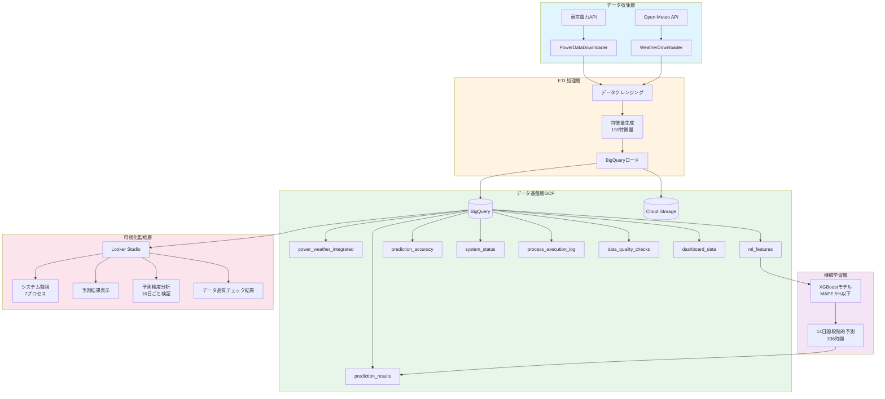

# 電力使用量予測パイプライン（Energy Demand Prediction Pipeline）

Google Cloud Platformを活用した、電力使用量の予測システムです。データ収集から予測、可視化までの完全自動化パイプラインを実装しています。

**このプロジェクトは個人開発により構築されたデータパイプラインです。**

## プロジェクト概要

**目的**: 東京電力管内の電力使用量を機械学習で予測
**予測精度**: MAPE 5%以下を達成
**予測期間**: 14日間（336時間）の時系列予測
**技術スタック**: Python 3.12 + XGBoost + Google Cloud Platform + Looker Studio

このプロジェクトは、データエンジニアリングとMLエンジニアリングのスキルを統合し、実務に近い開発プロセスで構築されています。

## 主要機能

### 1. 自動データ収集パイプライン
- **電力データ**: 東京電力APIから実績データを自動取得
- **気象データ**: Open-Meteo APIから関東全域の気象データを取得
- **データ品質チェック**: 欠損値・異常値の自動検知とログ記録

### 2. 機械学習による予測
- **XGBoostモデル**: 190特徴量を用いた時系列予測
- **特徴量エンジニアリング**:
  - ラグ特徴量（営業日ベース・全日ベース）
  - カレンダー特徴量（曜日・祝日・時間帯）
  - 気象特徴量（気温・湿度・降水量）
- **段階的予測**: 実運用を想定した14日間の段階的予測

### 3. データ基盤（Google Cloud Platform）
- **BigQuery**: データウェアハウス（8テーブル構成）
  - 電力・気象の統合データ
  - 予測結果の履歴管理
  - システム監視ログ
- **Cloud Storage**: 生データの永続化
- **Looker Studio**: リアルタイム監視ダッシュボード

### 4. 運用監視システム
- **7プロセス監視**: ETLパイプライン全体の実行状況を監視
- **データ品質チェック**: 自動品質検証とアラート
- **予測精度検証**: 16日ごとの精度検証と分析
- **エラーログ管理**: BigQueryに記録されたエラーログをLooker Studioで可視化
- **統合ダッシュボード**: [Looker Studioで可視化](https://lookerstudio.google.com/reporting/c99e4784-b17e-431f-97cb-0a624ecd97e0)

## システムアーキテクチャ



## 技術スタック

| カテゴリ | 技術 |
|---------|------|
| **言語** | Python 3.12 |
| **機械学習** | XGBoost, scikit-learn |
| **データ処理** | pandas, numpy |
| **クラウド** | Google Cloud Platform (BigQuery, Cloud Storage) |
| **BI/可視化** | Looker Studio, matplotlib, seaborn |
| **API** | 東京電力API, Open-Meteo API |
| **その他** | python-dotenv, requests |

## 予測精度と成果

### 予測精度（MAPE: Mean Absolute Percentage Error）

| モデル | MAPE | 説明 |
|--------|------|------|
| **カレンダー特徴量のみ** | 7%程度 | ベースライン（曜日・時間帯・祝日） |
| **全特徴量（固定予測）** | 3%程度 | 実測値ラグを使用 |
| **段階的予測（実運用）** | **5%以下** | 予測値ラグを使用 |

### 技術的成果

1. **予測精度MAPE 5%以下を達成**
   - 14日後の予測でも精度を維持

2. **完全自動化パイプライン**
   - データ収集からBigQuery投入まで完全自動化
   - cron + Pythonスクリプトにより日次自動実行を実現
   - 失敗時はリトライ処理を実装し、BigQueryログ経由で監視可能
   - システム監視とアラート

3. **実運用対応**
   - 土日祝日の欠損値自動処理
   - API制限への対応
   - パーティション設計による大規模データ管理

4. **データ品質管理**
   - 自動品質チェック（欠損値・外れ値検出）
   - 実行ログの完全記録
   - 予測精度の継続的検証

### 開発環境

**Claude Code**:
- AI支援開発ツールとしてペアプログラミング的に活用
- 全コードの読解・理解を実施
- 詳細な修正指示によりコード品質を維持
- 設計判断は開発者が主導

## プロジェクト構成

```
energy-env/
├── src/
│   ├── data_processing/          # データ収集・処理
│   │   ├── data_downloader.py    # 東京電力APIからデータ取得
│   │   ├── weather_downloader.py # 気象データ取得
│   │   ├── weather_bigquery_loader.py
│   │   ├── power_bigquery_loader.py
│   │   ├── ml_features_updater.py # 特徴量生成
│   │   ├── dashboard_data_updater.py
│   │   ├── prediction_accuracy_updater.py
│   │   └── system_status_updater.py
│   ├── pipelines/
│   │   └── main_etl.py           # 統合ETLパイプライン
│   ├── prediction/
│   │   └── prediction_iterative_with_export.py # 予測実行
│   ├── monitoring/
│   │   └── data_quality_checker.py # データ品質チェック
│   └── utils/
│       └── logging_config.py      # ログ設定
├── sql/                           # BigQueryテーブル定義
├── scripts/                       # 運用スクリプト
├── requirements.txt               # Python依存パッケージ
└── SETUP.md                       # セットアップ手順
```

## セットアップ

### 前提条件

- Python 3.12以上
- Google Cloud Platformアカウント
- BigQueryプロジェクト

### インストール手順

1. **リポジトリのクローン**
```bash
git clone https://github.com/yourusername/energy-data-platform.git
cd energy-data-platform
```

2. **仮想環境の作成と有効化**
```bash
python -m venv venv

# Windows
venv\Scripts\activate

# Linux/Mac
source venv/bin/activate
```

3. **依存パッケージのインストール**
```bash
pip install -r requirements.txt
```

4. **環境変数の設定**
```bash
# .envファイルを作成（.env.templateを参考に）
cp .env.template .env

# 必要な環境変数を設定
ENERGY_ENV_PATH=/path/to/energy-env
GOOGLE_APPLICATION_CREDENTIALS=/path/to/service-account-key.json
GCP_PROJECT_ID=your-project-id
```

5. **BigQueryテーブルの作成**
```bash
# sqlディレクトリ内のSQLファイルを実行
```

詳細なセットアップ手順は [SETUP.md](./SETUP.md) を参照してください。

## 使用方法

### 日次データ収集と予測実行

```bash
# 仮想環境の有効化
source venv/Scripts/activate

# データ収集（過去7日分）
python -m src.pipelines.main_etl --days 7

# 予測実行（14日間予測 + CSV出力）
python -m src.prediction.prediction_iterative_with_export
```

### データ品質チェック

```bash
# ML特徴量の欠損値チェック
python -m src.utils.check_ml_features_missing
```

## 開発プロセス

このプロジェクトは11のフェーズで段階的に開発されました：

| Phase | 内容 | 主要成果 |
|-------|------|---------|
| **Phase 1-2** | 電力データ基盤 | 東京電力API統合、30ヶ月分データ取得 |
| **Phase 3-4** | 気象データ基盤 | Open-Meteo API統合、BigQuery自動投入 |
| **Phase 5-6** | 特徴量エンジニアリング | 190特徴量生成、時系列分析 |
| **Phase 7** | 機械学習モデル構築 | XGBoost実装、MAPE 2.33%達成 |
| **Phase 8** | モデル評価・改善 | 評価指標深層理解、残差分析 |
| **Phase 9** | 品質向上 | 外れ値削減、MAPE 2.15%達成 |
| **Phase 10** | 自動化システム | 日次自動予測、土日祝日対応 |
| **Phase 11** | 監視・可視化 | Looker Studio、7プロセス監視 |

## 技術的ハイライト

### 1. 特徴量エンジニアリング

**190特徴量の構成**:
- カレンダー特徴量（14種）: 曜日、時間帯、祝日、循環特徴量
- ラグ特徴量（営業日ベース・全日ベース、各90種）
- 気象特徴量: 気温、湿度、降水量、天気コード

```python
# 営業日ベースラグ特徴量の例
- lag_1_business_day, lag_2_business_day, ..., lag_30_business_day  # 30特徴量
- avg_5_business_days, avg_10_business_days, ...                    # 6特徴量
- change_rate_1_business_day, ...                                   # 30特徴量
```

### 2. 段階的予測ロジック

実運用では未来のラグ特徴量が存在しないため、予測値を使用して段階的に予測を進めます：

```python
# 予測日（1日目）: 実測値ラグを使用
predict(day=1) → 高い精度

# 14日後: 予測値ラグを使用
predict(day=14) → 精度を維持

# 14日間全体: MAPE 5%以下
```

### 3. BigQueryテーブル設計

**パーティション戦略**:
- `process_execution_log`: 処理実行日でパーティション
- `prediction_results`: 予測実行日でパーティション
- `prediction_accuracy`: 検証実行日でパーティション

テーブル設計では、処理日ベースのパーティション分割を採用し、増分処理・再計算・監視分析の効率化を実現しています。

### 4. システム監視

**7プロセス監視**:
1. DATA_DOWNLOAD - 電力データ取得
2. WEATHER_DOWNLOAD - 気象データ取得
3. WEATHER_BQ_LOAD - 気象データBigQuery投入
4. POWER_BQ_LOAD - 電力データBigQuery投入
5. ML_FEATURES_UPDATE - 特徴量更新
6. DATA_QUALITY_CHECK - データ品質チェック
7. PREDICTION - 予測実行

各プロセスの実行状態、所要時間、エラー情報をLooker Studioで可視化しています。

## 今後の展望

- Apache Airflowによるワークフロー管理・スケジューリング
- Web UIでのパイプライン監視・制御機能

## スキルセット
- データエンジニアリング（ETL、データパイプライン、BigQuery）
- 機械学習（XGBoost、特徴量エンジニアリング、時系列予測）
- Google Cloud Platform（BigQuery、Cloud Storage、Looker Studio）
- Python開発（pandas、numpy、scikit-learn）
- システム設計（自動化、監視、エラーハンドリング）

## ライセンス

このプロジェクトは個人の学習・ポートフォリオ目的で作成されています。

---

**お問い合わせ**: プロジェクトに関するご質問やフィードバックは、GitHubのIssuesまでお願いします。
